<h1>Catat Duit </h1>  
<h3>UAS Pemrograman Mobile 2 – Kelompok 2</h3>
 

Catat Duit adalah aplikasi mobile berbasis <b>Flutter</b> yang digunakan untuk mencatat dan mengelola keuangan pengguna, seperti pemasukan dan pengeluaran, sehingga pengguna dapat memantau kondisi keuangannya dengan lebih teratur dan efisien 
Aplikasi ini juga memiliki fitur pencatatan tagihan, dengan fitur ini user dapat mengingat tagihan yang harus di bayar. 
Database aplikasi ini menggunakan Firebase dan untuk menyimpan data pengguna menggunakan Firebase auth dan juga disertai dengan Firebase Google Auth

 
<h4>Aplikasi sudah disimpan di <b>Release</b></h4>
<h3>Aplikasi ini dikembangkan oleh Kelompok 2:</h3>
<ul>
  <li>Annisa Nur Fitriani (23552011192)</li>
  <li>Cindy Marcelina (23552011031)</li>
  <li>Muhammad Rafi Fadillah (23552011066)</li>
  <li>Muhammad Nizham H. (23552011241)</li>
  <li>Rizky Fauzi (23552011070)</li>
</ul>
 
<h3>Video Demo</h3>

  

 
<h2>Getting Started</h2>
<h3>Fitur Aplikasi</h3>
- Menambahkan data pemasukan 
- Menambahkan data pengeluaran 
- Menambahkan data tagihan 
- menghapus dan mengedit data 
- Menampilkan daftar transaksi 
- Memantau saldo melalui grafik bar dan grafik pie 
- Mengelompokkan transaksi berdasarkan kategori 
- Menampilkan tanggal dan nominal transaksi 
- Antarmuka sederhana dan mudah digunakan 
 
<h3>Teknologi yang Digunakan</h3>
- Flutter (Framework) 
- Dart (Bahasa Pemrograman) 
- Firebase (Database) 
- Firebase Auth  
- Material Design 
 
<h3>Setting Firebase</h3>

Aplikasi ini sudah memakai firebase untuk databasenya dan untuk penyimpanan data user sudah memakai Firebase auth dan Google Auth

 
 
<h2>Screenshoot Aplikasi</h2>
<h3>1. Splash Screen</h3>
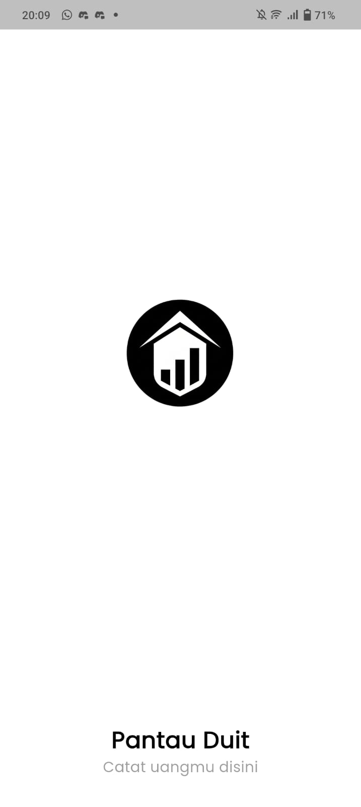

<h3>2. Halaman Login dan Register</h3>
<table>
  <tr>
    <td align="center">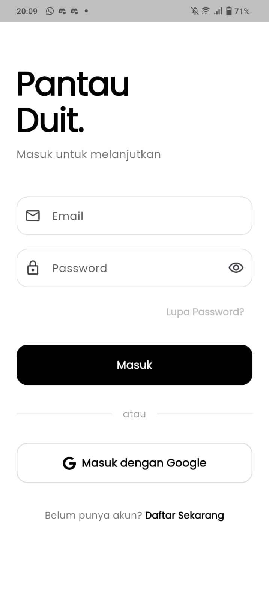</td>
    <td align="center">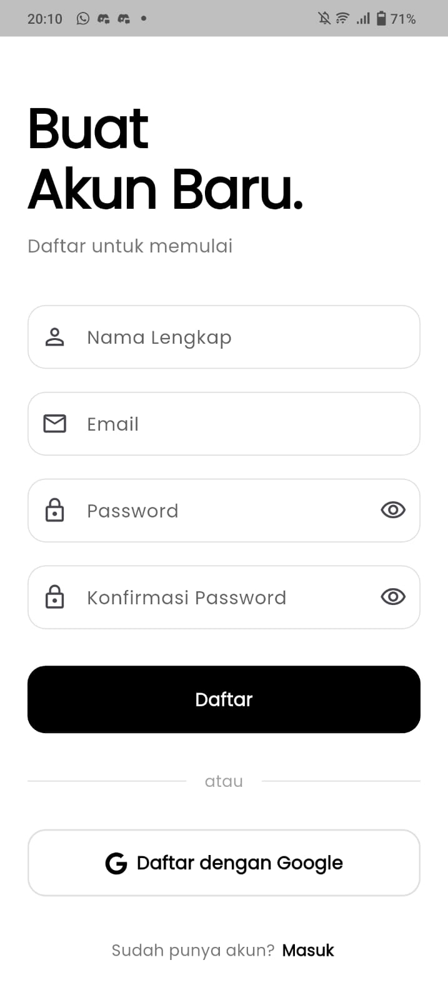</td>
  </tr>
  <tr>
    <td align="center"><b>Halaman Login</b></td>
    <td align="center"><b>Halaman Register</b></td>
  </tr>
</table>

<h3>3. Halaman Home dan Notifikasi</h3>
<table>
  <tr>
    <td align="center">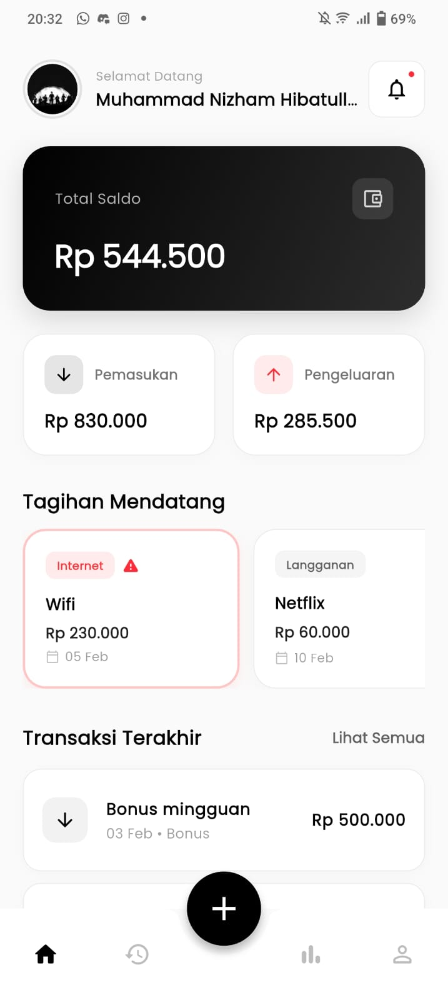</td>
    <td align="center">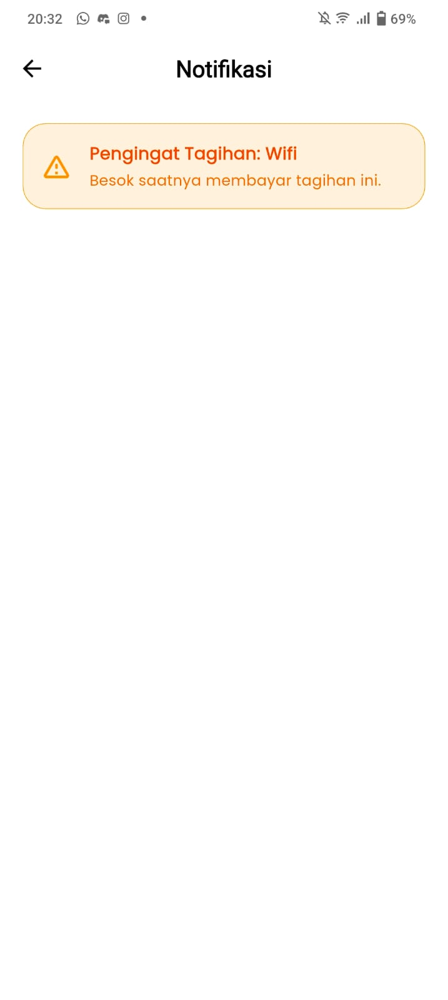</td>
  </tr>
  <tr>
    <td align="center"><b>Halaman Home</b></td>
    <td align="center"><b>Halaman Notifikasi</b></td>
  </tr>
</table>

<h3>4. History</h3>

<h3>5. Detail Transaksi dan Detail Tagihan</h3>
<table>
  <tr>
    <td align="center">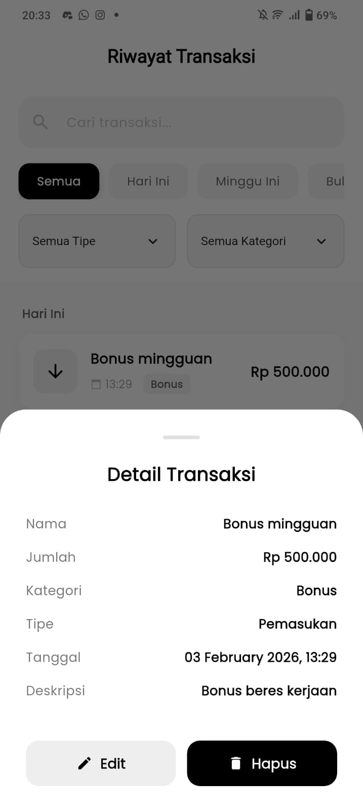</td>
    <td align="center">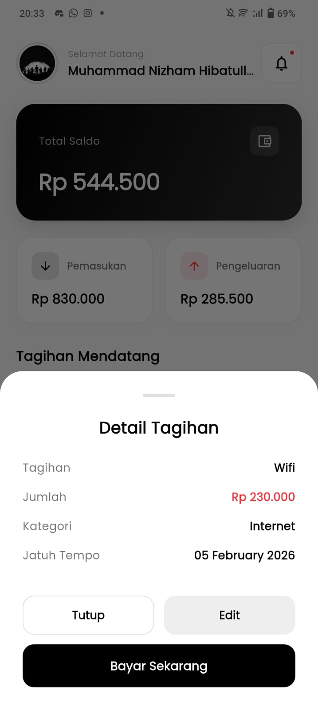</td>
  </tr>
  <tr>
    <td align="center"><b>Detail Transaksi</b></td>
    <td align="center"><b>Detail Tagihan</b></td>
  </tr>
</table>

<h3>6. Halaman Tambah/Edit dan Konfirmasi Hapus</h3>
<table>
  <tr>
    <td align="center">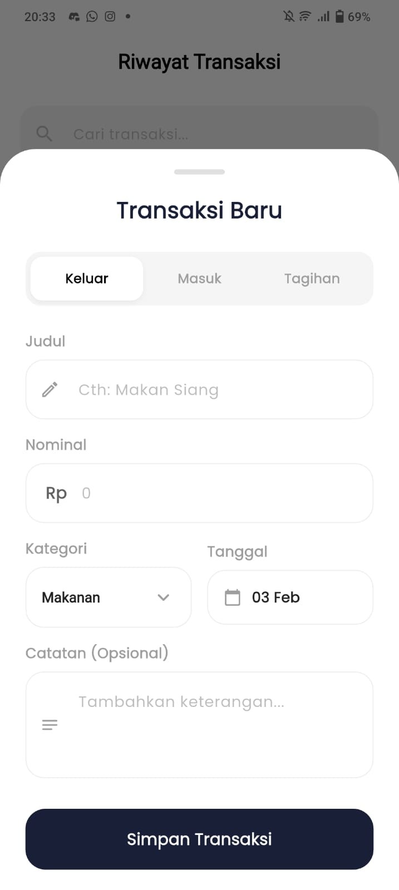</td>
    <td align="center">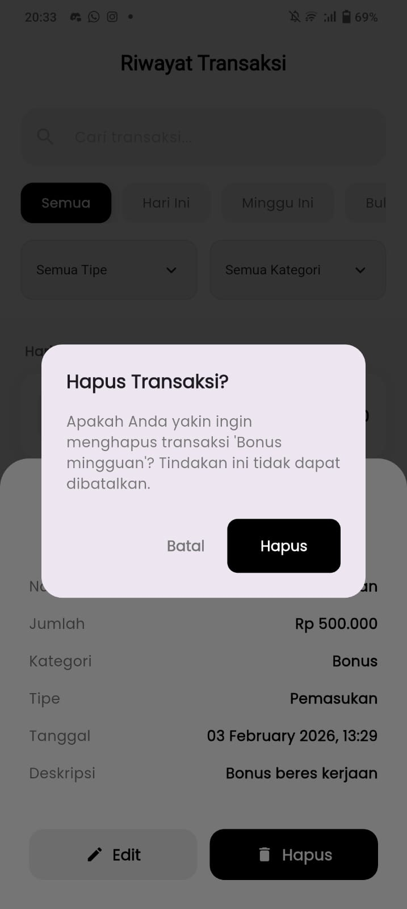</td>
  </tr>
  <tr>
    <td align="center"><b>Tambah/Edit</b></td>
    <td align="center"><b>Hapus</b></td>
  </tr>
</table>

<h3>7. Statistik dan Breakdown Kategori</h3>
<table>
  <tr>
    <td align="center"></td>
    <td align="center">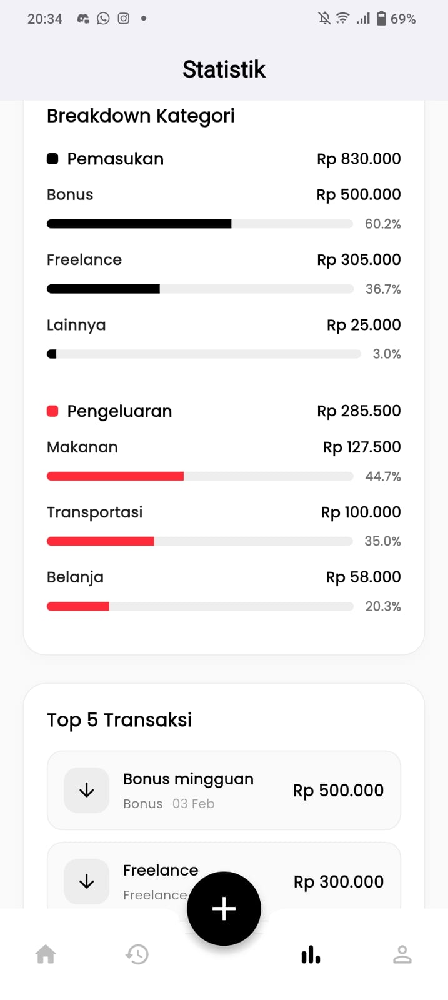</td>
  </tr>
  <tr>
    <td align="center"><b>Statistik</b></td>
    <td align="center"><b>Breakdown Kategori</b></td>
  </tr>
</table>

<h3>8. Grafik Bar dan Grafik Pie</h3>
<table>
  <tr>
    <td align="center"></td>
    <td align="center">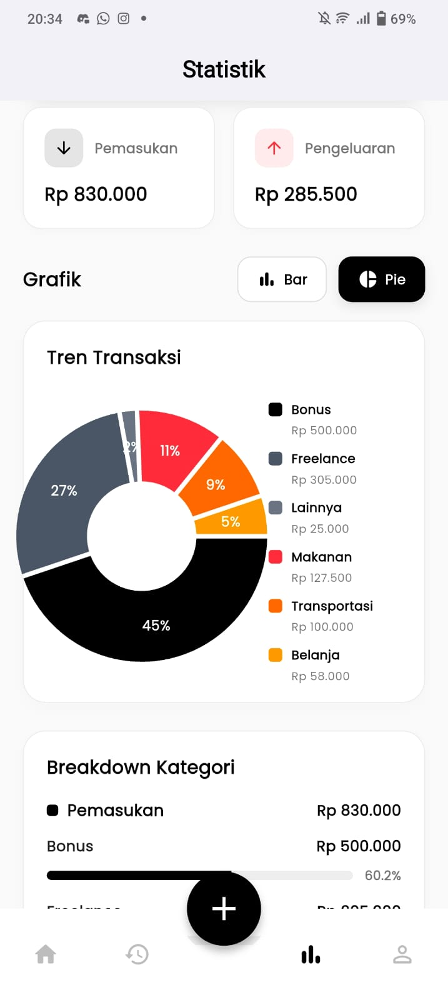</td>
  </tr>
  <tr>
    <td align="center"><b>Bar</b></td>
    <td align="center"><b>Pie</b></td>
  </tr>
</table>

<h3>About</h3>
<table>
  <tr>
    <td align="center"></td>
    <td align="center">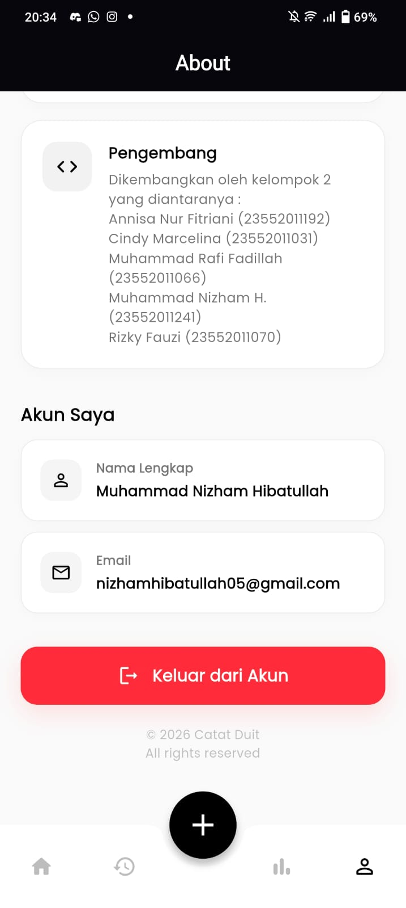</td>
  </tr>
  <tr>
    <td align="center"><b>Top About</b></td>
    <td align="center"><b>Info Pengembang</b></td>
  </tr>
</table>

